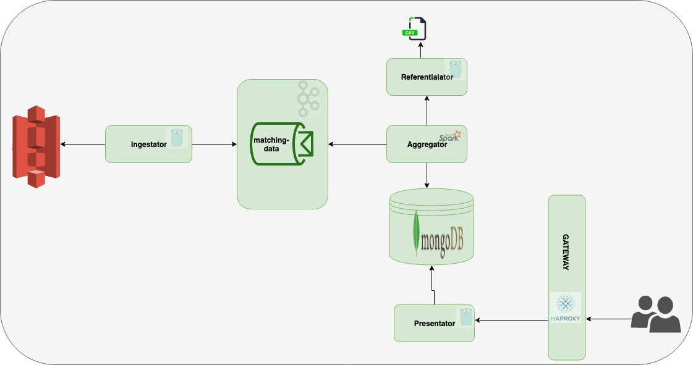

# challenge

> This directory contains the global architecture.
> To run it: `make up-dev`.

> URLs which can help you:

* [ha-rpoxy](http://localhost:8666/haproxy?stats)  
* [mongo-express](http://localhost/mongo-express/) 
* [referentialator](http://localhost/referentialator/v1/referentials/polygons.psv) 
* [presentator request](http://localhost/presentator/v1/match-aggregator/request/) 
* [presentator driver](http://localhost/presentator/v1/match-aggregator/driver/) 

## Requirements

- [ ] make
- [ ] docker
- [ ] docker-compose

## Architecture

## Projects

### Project referentialator

> This project is developed in `Go`. It is a static server on referential files. A better way would be to store the data in a database.

### Project ingestator

> This project is developed in `Go`. It reads files from S3 and produces messages to kafka.

### Project aggregator

> This project is developed in `Scala`. It is a spark streaming job that listens to kafka and aggregates matching data. It stores the aggregations in mongodb.

### Project presentator

> This project is developed in `Go`. It exposes an endpoint which takes as parameters a position (latitude and longitude), a timestamp, a smoothing parameter α ∈ [0;1] and a precision parameter p and that will return the adjusted values of request and driver match rate.

### Project gateway

> This project contains the gateway settings [ha proxy](http://localhost:8666/haproxy?stats).
> The gateway is in front of the presentator service and referentialator service. 

## Integration system test

> This integration test is designed to ensure the integrity of all the components and the communication between them.

To run the test:
* `make up-dev`: starts all the components as docker images
* `make it-test`: runs postman collections under `collections` directory. For now, it only checks the status code. To do check data.     

Each module has its own `integration test` and readmes to explain how to run them.