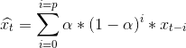

# Data Engineer - Technical Test

> Enjoy your night out

## **Context**

Given a night with 40000 ride requests and 10000 available drivers in a fictional city, you have to develop a batch processing application that would aggregate and expose data coming from the matching engine.

Every 10 seconds, the matching engine tries to match every pair of request and driver that are available in the city. Some are matched, some are not. 
The results of each matching tick are stored in a set of files on AWS S3.

The matching results follow this schema:

    matching_id :
    request_id :
    request_latitude :
    request_longitude :
    driver_id :
    driver_latitude :
    driver_longitude :
    match :
    computed_at :

Given this data we want to be able to get a overview of the marketplace health and multiple applications could follow such as heat maps.

The metrics that we want to use for heat mapping are `driver match rate` and `request match rate`.

With `driver match rate` as the number of drivers matched over the total number of drivers that went through the matching engine. 

And `request match rate` the number of requests matched over the total number of requests that went through the matching engine.

All data are stored here :
`s3://challenge-technical-test/data-engineer`

## **Exercice**

Develop a microservice that will: 

1. Aggregate matching data by:
    * fetching new matching data stored in S3 every 5 minutes to simulate new data ingestion.
    * exploiting this data in order to aggregate `driver match rates` and `request match rates` by geo-spatial units of your choice (squares, hexagones, etc) and time period `t = 5` minutes using parallel processing.
    * storing the output results in a database of your choice.

This service will take advantages of a parallel processing framework such as Spark or equivalent.

  
2.  Expose an endpoint which takes as parameters a position (latitude and longitude), a timestamp, a smoothing parameter `α ∈ [0;1]` and a precision parameter `p` and that will return the adjusted values of request and driver match rate, following this formula:

  
 
 

##   **Bonus**
- Plot the driver and request match rate for one night. 📊
## **Workflow**
- The application must be hosted on this Github repository.
- Choose the programming language of your choice to develop your services (Java, Python, Scala, Go, etc.).
- Choose the Data stack of your choice (parallel processing framework, database, etc.)
- Create a new branch.
- Commit and push to this branch.
- Submit a pull request once you are done.
- Provide us a global overview scheme of the global application (architecture, etc.) with simple explanations of your choices.

We will then review together your proposition on Github.

If you have any questions or need more information, feel free to open an issue!

Happy hacking! :)
